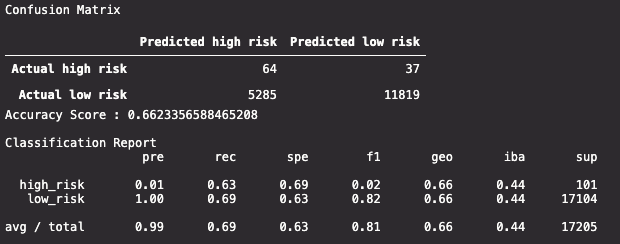

# Credit Risk Analysis

## Overview of Project

### Purpose

Our objective is to employ different Machine Learning techniques to evaluate credit card risk, while focusing on the unbalanced nature of good loans far outnumbering risky loans.

### Resources
- Data: [2019 Q1 Loan Stats](Module-17-Challenge-Resources/LoanStats_2019Q1.csv)
- Software: Python, pandas, numpy, skikit-learn, imbalanced-learn, VS Code

## Project Results

### Over Sampling
#### RandomOverSampler

- <strong>Accuracy score:</strong> 0.6742
- <strong>True positives:</strong> 75, <strong>false postives:</strong> 6740, <strong>false negatives:</strong> 26, <strong>true negatives:</strong> 10364
- <strong>Precision:</strong> 0.99, <strong>recall:</strong> 0.61, <strong>f1 score:</strong> 0.75

#### SMOTE

- <strong>Accuracy score:</strong> 0.6623
- <strong>True positives:</strong> 64, <strong>false postives:</strong> 5285, <strong>false negatives:</strong> 37, <strong>true negatives:</strong> 11819
- <strong>Precision:</strong> 0.99, <strong>recall:</strong> 0.69, <strong>f1 score:</strong> 0.81

### Under Sampling
#### ClusterCentroids

- <strong>Accuracy score:</strong> 0.5443
- <strong>True positives:</strong> 70, <strong>false postives:</strong> 10340, <strong>false negatives:</strong> 31, <strong>true negatives:</strong> 6764
- <strong>Precision:</strong> 0.99, <strong>recall:</strong> 0.40, <strong>f1 score:</strong> 0.56

### Combinatorial Sampling
#### SMOTEENN

- <strong>Accuracy score:</strong> 0.6434
- <strong>True positives:</strong> 72, <strong>false postives:</strong> 7288, <strong>false negatives:</strong> 29, <strong>true negatives:</strong> 9816
- <strong>Precision:</strong> 0.99, <strong>recall:</strong> 0.57, <strong>f1 score:</strong> 0.72

### Ensemble Classifiers
#### BalancedRandomForestClassifier

- <strong>Accuracy score:</strong> 0.7475
- <strong>True positives:</strong> 152, <strong>false postives:</strong> 6315, <strong>false negatives:</strong> 94, <strong>true negatives:</strong> 45051
- <strong>Precision:</strong> 0.99, <strong>recall:</strong> 0.88, <strong>f1 score:</strong> 0.93

#### EasyEnsembleClassifier

- <strong>Accuracy score:</strong> 0.8229
- <strong>True positives:</strong> 186, <strong>false postives:</strong> 5662, <strong>false negatives:</strong> 60, <strong>true negatives:</strong> 45704
- <strong>Precision:</strong> 0.99, <strong>recall:</strong> 0.61, <strong>f1 score:</strong> 0.75

## Summary
### Conclusion
Summarize the results of the machine learning models, and include a recommendation on the model to use, if any. If you do not recommend any of the models, justify your reasoning